# 视频实时去背景调研报告
<!-- TOC -->

- [视频实时去背景调研报告](#视频实时去背景调研报告)
  - [基本要求](#基本要求)
  - [场景分析](#场景分析)
  - [视频前景提取算法（visual background extractor，ViBe）](#视频前景提取算法visual-background-extractorvibe)
    - [论文信息](#论文信息)
    - [基本原理](#基本原理)
    - [效果](#效果)
    - [评价](#评价)
  - [基于深度学习-实时语义分割](#基于深度学习-实时语义分割)
  - [用于实时语义分割的轻量级RefineNet](#用于实时语义分割的轻量级refinenet)
    - [论文信息](#论文信息-1)
    - [基本原理](#基本原理-1)
    - [效果](#效果-1)
    - [评价](#评价-1)
  - [DFANet:用于实时语义分割的深层特征聚合网络](#dfanet用于实时语义分割的深层特征聚合网络)
    - [论文信息](#论文信息-2)
    - [基本原理](#基本原理-2)
    - [效果](#效果-2)
    - [评价](#评价-2)
  - [实现实时语义分割的双向网络 BiSeNet V2](#实现实时语义分割的双向网络-bisenet-v2)
    - [论文信息](#论文信息-3)
    - [基本原理](#基本原理-3)
    - [效果](#效果-3)
    - [评价](#评价-3)
  - [基于NAS的自动设计的实时语义分割网络FasterSeg](#基于nas的自动设计的实时语义分割网络fasterseg)
    - [论文信息](#论文信息-4)
    - [基本原理](#基本原理-4)
    - [效果](#效果-4)
    - [评价](#评价-4)
  - [各方案对比](#各方案对比)
  - [Questions](#questions)

<!-- /TOC -->

## 基本要求
   - 直播场景去除主播的背景，达到绿幕效果
   - 实时性(在一定输出分辨率和码率的情况下达到一定的FPS，20-25帧一般为标清，目前主播大多数在25帧左右)

## 场景分析
   - 人物移动幅度小，其他物体移动情况很少
   - 光照变化不大
   - 原背景基本不变，基本处于室内，背景应该不复杂

## 视频前景提取算法（visual background extractor，ViBe）
### 论文信息
   - 论文名称：《ViBe: A universal background subtraction algorithm for video sequences》
   - 作者机构：Olivier Barnich and Marc V an Droogenbroeck, Member , IEEE
   - 年份：Jun-2011
   - 发表会议：IEEE
   - 论文链接：https://orbi.uliege.be/bitstream/2268/145853/1/Barnich2011ViBe.pdf
   - 开源实现：https://orbi.uliege.be/handle/2268/145853

### 基本原理
- 具体的思想就是为每个像素点存储了一个样本集，样本集中采样值就是该像素点过去的像素值和其邻居点的像素值(相邻像素点拥有相近像素值的空间分布特性)，然后将每一个新的像素值和样本集进行比较来判断是否属于背景点。
  
  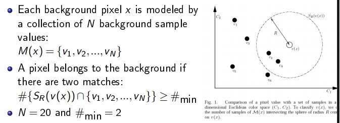

- 背景模型能够根据第一帧初始化:ViBe的初始化仅仅通过一帧图像即可完成。ViBe初始化就是填充像素的样本集的过程。由于在一帧图像中不可能包含像素点的时空分布信息，所以利用了相近像素点拥有相近的时空分布特性，具体来讲就是：对于一个像素点，随机的选择它的邻居点的像素值作为它的模型样本值。
- 根据背景模型更新策略，能够自动更新适应背景变化。保守更新策略与空间信息相结合的方法，还可以加入前景计数方法。

### 效果
- 实测

   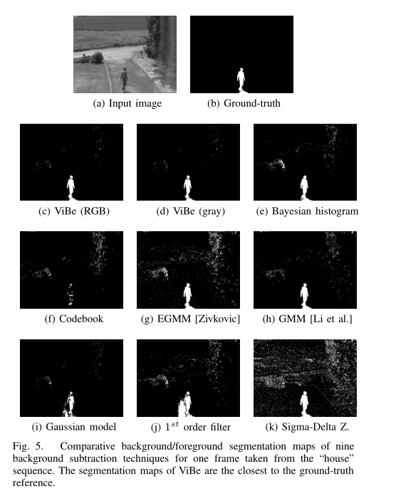

- 帧率：640*480 pixels 达到150+ 

   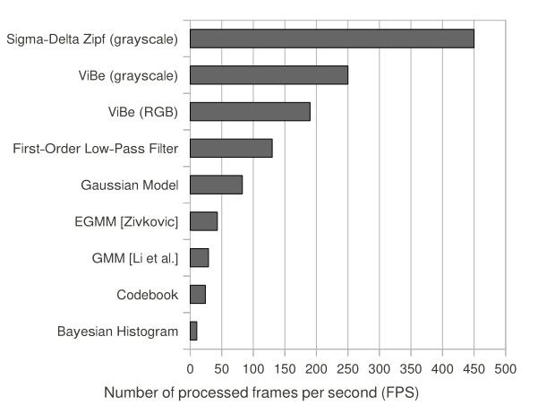

- 视频实测：http://www.telecom.ulg.ac.be/research/vibe/

### 评价
- 优点：算法比较简单，性能优于GMM等。对于光照的变化和相机抖动等的效果都十分稳定，而且计算量非常小，内存占用较少，实时性高，可以嵌入照相机中。
- 缺点：
  - 静止目标（长时间不动可能被融入背景）
  - 阴影前景（由于光线被人体或车体运动目标所遮挡，投射阴影区的背景被误检为运动目标前景。）
  - 运动目标不完整（空洞和断层）
  - 对于不同分辨率的画面可能需要寻找不同的参数
- 实时性和效率是其优点，但是去除背景的效果质量一般，基本满足实时直播背景去除，可以考虑

## 基于深度学习-实时语义分割
- 图像语义分割的目标在于标记图片中每一个像素，并将每一个像素与其表示的类别对应起来。对于本课题，只要将背景和主播(包括人和直播用具)这两类物体在图像中的像素区别开来就有办法实现背景去除，故而直播背景去除可以看作一个语义分割问题。
  
   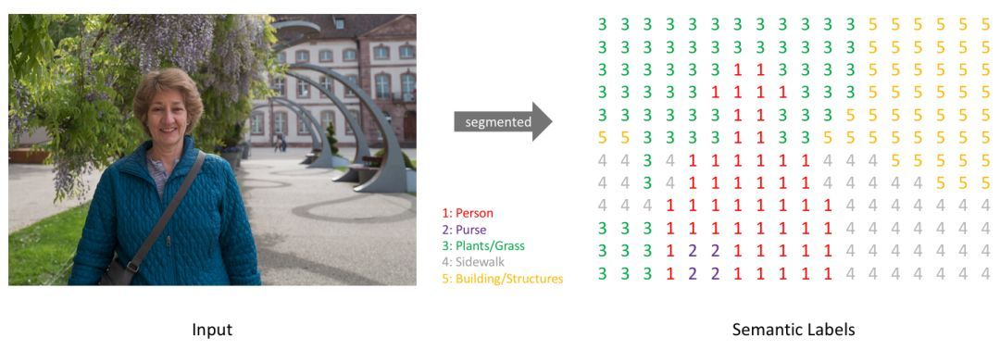

- 常用的图像分割模型的方法遵循编码器/解码器结构，在这个结构中，我们对输入的空间分辨率下采样，产生分辨率更低的特征图，通过学习这些特征图可以更高效地分辨类别，还可以将这些特征表征上采样至完整分辨率的分割图。

- 语义分割面临的主要是语义(物体检测)和位置(精度)之间的紧张关系：全局信息解决语义问题，而局部信息解决位置问题……将精细层和粗略层结合，使模型做出不违背全局结构的局部预测。
  - 全卷积网络FCN:获得一张2维的feature map，后接softmax获得每个像素点的分类信息，从而解决了分割问题.
  - 跳过连接：使用多层feature融合有利于提高分割准确性。

- 相对于图像语义分割，视频语义分割要求高帧数，且有前后帧高度相关的特点

## 用于实时语义分割的轻量级RefineNet 

### 论文信息

   - 论文名称: 《Light-weight RefineNet for Real-Time Semantic Segmentation 》
   - 作者机构：Vladimir Nekrasov，Chunhua Shen，Ian Reid. University of Adelaide（阿德莱德大学，澳大利亚）
   - 年份：2018
   - 发表会议：BMVC
   - 论文链接：https://arxiv.org/pdf/1810.03272.pdf
   - 开源实现：https://github.com/DrSleep/light-weight-refinenet

   - 改进版本《Real-Time Joint Semantic Segmentation and Depth Estimation Using Asymmetric Annotations》 17ms 同一个深度学习网络中同时实现语义分割与深度估计

### 基本原理
- 突出了轻量级和效率，在CVPR 2017的RefineNet语义分割算法基础上减少模型参数和计算量
- RefineNet使用经典的编码器-解码器架构，CLF为3*3卷积，卷积核个数为语义类的个数，编码器的骨干网可以是任意图像分类特征提取网络，重点是解码器部分含有RCU、CRP、FUSION三种重要结构。该文使用RCU-LW、CRP-LW、FUSION-LW轻量化RefineNet。替换3*3卷积为1*1卷积，尝试省略RCU模块，尝试使用了轻量级骨干网络并保持稳健性能。

  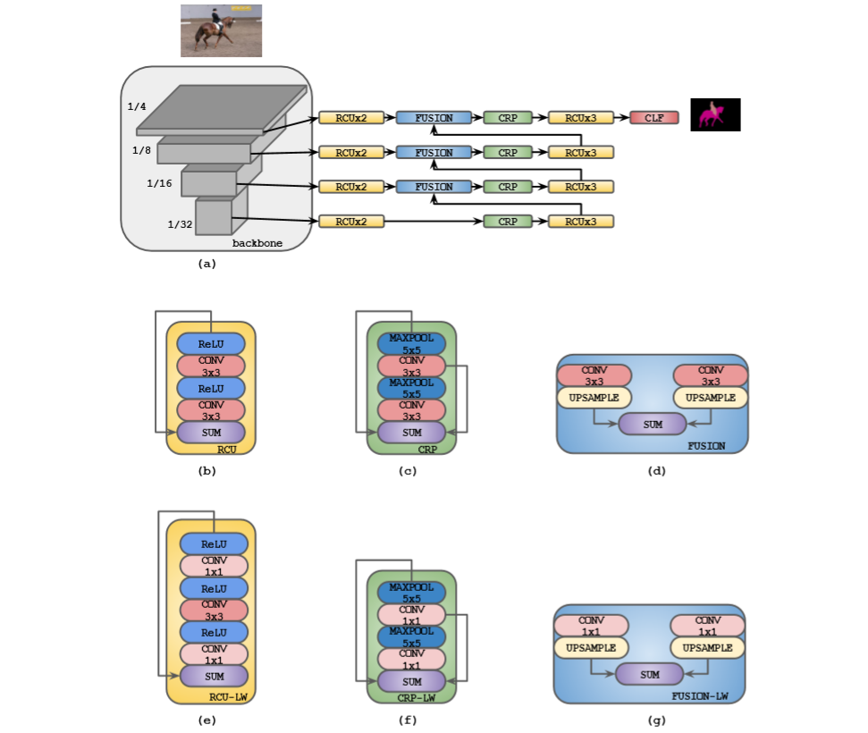

### 效果
- 实测
  
   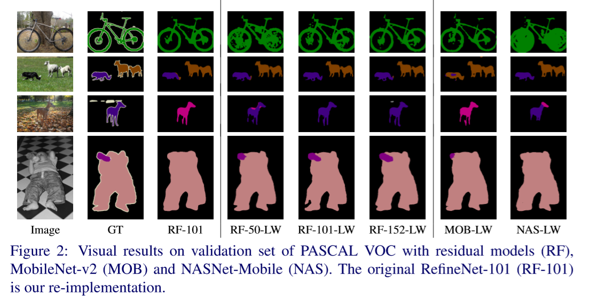

- 数据 

   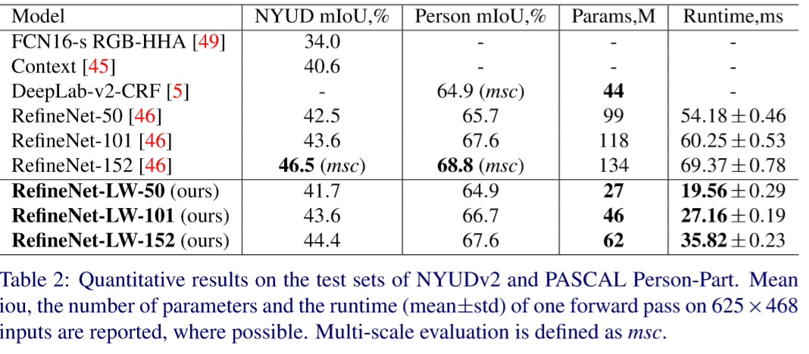

- 帧率： 512X512输入，GTX 1080Ti GPU, 55 FPS, Mean IOU 81.1%，PASCAL VOC测试集
### 评价
- 突出优势是轻量级，参数少计算量小，将原始RefineNet参数量减少一半以上仍能够达达到近似水平。
- 缺点是实验只测试了输入图像较小的情况下实时分割的表现，当直播时采用较大分辨率的如常用的1280×720甚至更高如1920×1080情况如何还不确定。一般情况下，主播画面分辨率不高，512X512应该可以满足。像新闻联播式的全屏高清直播背景实时去除可能无法满足。

## DFANet:用于实时语义分割的深层特征聚合网络
### 论文信息
   - 论文名称：《DFANet：Deep Feature Aggregation for Real-Time Semantic Segmentation》
   - 作者机构：Hanchao Li, Pengfei Xiong, Haoqiang Fan, Jian Sun 旷视
   - 年份：2019
   - 发表会议：CVPR
   - 论文链接：https://arxiv.org/pdf/1904.02216.pdf
   - 开源实现：https://github.com/huaifeng1993/DFANet

### 基本原理
- 首先将从 backbone 中抽取得到的高层特征重复利用，对语义信息和结构细节进行tradeoff；其次，将网络的处理过程的不同阶段所获得的特征进行组合，来提高特征的表达能力
- 包含三个重要结构
  - lightweight backbones
  
  - sub-network aggregation:是将高层特征进行结合，将DFANet作为一个backbones的集合，也就是将上一个backbone的输出作为下一个backbone的输入。换句话说，sub-network 聚合可以被看成一个精细化的过程
  - sub-stage aggregation：融合多个网络间的stage-level的语义和空域信息，对同一深度下不同stage之间的特征进行融合。
  
   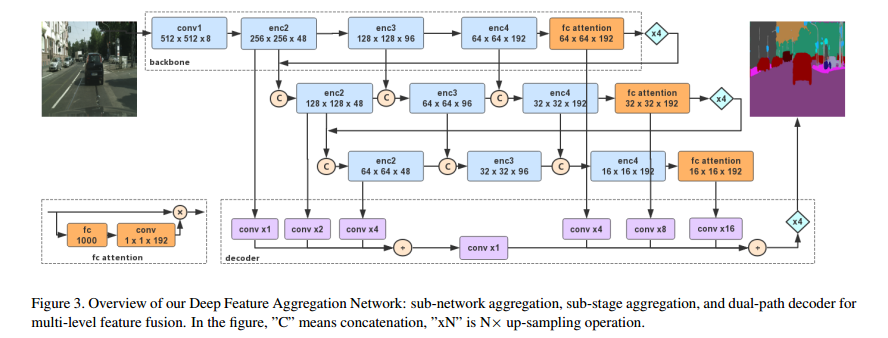

### 效果
- 实测
  
   
   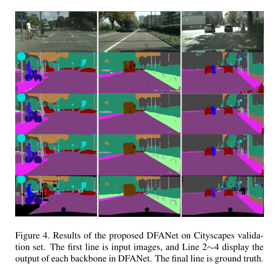

- 数据( a single Titan X GPU card)
  
   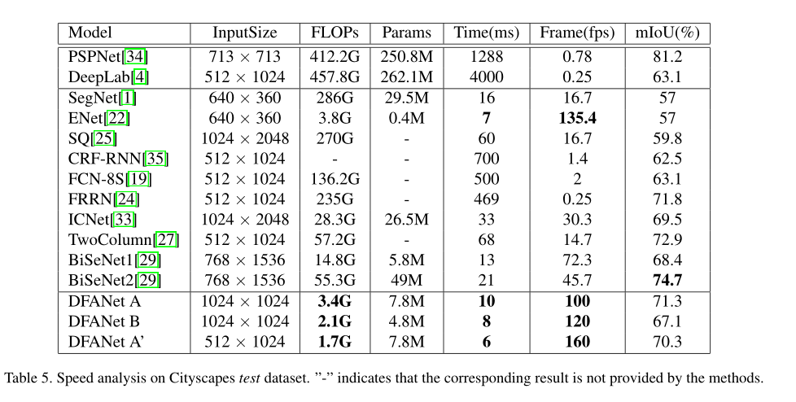

### 评价
- DFANet突出优势是解决了高分辨率下实时语义分割，在高帧率小计算量的情况下依然获得很高的分割精度，弥补了RefineNet对于高分辨率的处理不足，且同样具有轻量级的优点。对于直播场景的实时背景去除是一个不错的解决方案。

## 实现实时语义分割的双向网络 BiSeNet V2  

### 论文信息
   - 论文名称：《BiSeNet V2: Bilateral Network with Guided Aggregation for Real-time Semantic Segmentation》
   - 作者机构：Changqian Yu, Changxin Gao,Jingbo Wang, et al. 旷视
   - 年份：2020 
   - 发表会议：CVPR (BiSeNet V1, 2018 ECCV)
   - 论文链接：https://arxiv.org/pdf/2004.02147.pdf
   - 开源实现
     - https://github.com/MaybeShewill-CV/bisenetv2-tensorflow
     - https://github.com/CoinCheung/BiSeNet

### 基本原理
- BiSeNet V2将空间细节和分类语义分开处理，以实现高精度和高效率的实时语义分割
- 包括四个主要结构
  - Detail Branch：主干网络中细节分支，捕获低层细节并生成高分辨率的特征表示
  - Semantic Branch：主干网络中的语义分支，获取高层次语义 
  - Aggregation Layer：引导聚合层，增强相互连接和融合细节和语义两种类型的特征表示。可以看作一个子网目的是学习如何融合Detail和Semantic。这与DFANet中将深层语义和浅层细节的输出简单组合的方式不同，而是让神经网络自己去学习如何融合这两方面的特征。
  - Booster：推理部分，设计了一些辅助分割头，以提高分割性能，没有任何额外的推理成本。

   

### 效果
- 实测

   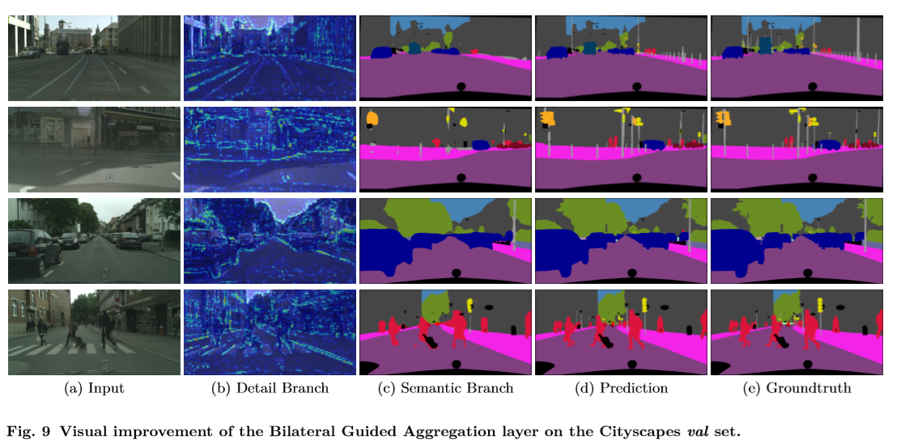

- 数据(NVIDIA 1080Ti GPU)

   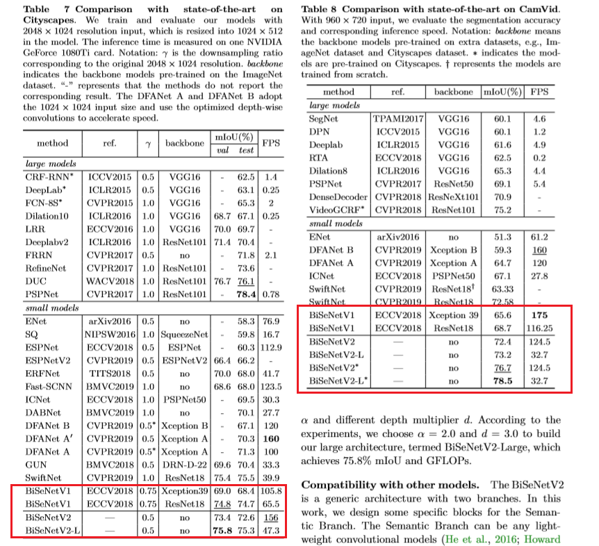

### 评价
- BiSeNet V2是一种高效的实时语义分割体系结构，是轻量级实时语义分割经典BiSeNet的进化版本。其双通道结构以及引导聚合层很好地保证了语义和细节的兼顾。由于引入了增强训练策略，进一步提高了分割性能。在实测效果上，精度和速度能够满足实时语义分割的要求，且满足高分辨率(2048*1024)输入。故而该方案应该可以运用到实时分离直播场景下的前后景当中，达到背景实时去除的效果。

##  基于NAS的自动设计的实时语义分割网络FasterSeg

### 论文信息
   - 论文名称：《FasterSeg: Searching for Faster Real-time Semantic Segmentation 》
   - 作者机构：Wuyang Chen, Xinyu Gong, Xianming Liu, et al. Department of Computer Science and Engineering, Texas A&M University 
   - 年份：2020
   - 发表会议：ICLR
   - 论文链接：https://arxiv.org/pdf/1912.10917.pdf
   - 开源实现：https://github.com/TAMU-VITA/FasterSeg

### 基本原理
- 手工设计出高性能的神经网络需要大量的专业知识与反复试验，成本极高，限制了神经网络在很多问题上的应用。神经结构搜索（Neural Architecture Search，简称NAS）是一种自动设计神经网络的技术，可以在搜索空间内按照一定策略和搜索得到性能优异的神经网络
- 该文章提出了设计特殊的搜索空间能够支持不同分辨率的多个分支的优化，而不是single backbone，并且能够自适应地聚合以进行最终预测。
- 设计一个分离的细粒度的延迟正则化，平衡了延迟和准确度，缓解了延迟约束搜索中的“架构崩溃”问题。
- 知识蒸馏。可以在一次搜索中协作搜素一个复杂的教师网络和轻量级的学生网络

### 效果
- 实测

   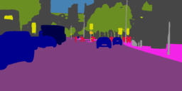

- 数据 (NVIDIA 1080Ti GPU)

   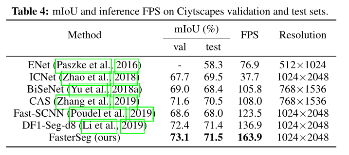

### 评价
- FasterSeg是基于NAS自动设计的一个解决实时语义分割的神经网络,其准确率和速度都达到了十分优秀的程度，满足实时视频背景和前景的分割。但是其网络结构比较复杂，所需要的训练时间应该比较长，算力资源要求应该也比较高。条件支持的情况下可以考虑。

## 各方案对比
- 调研报告共罗列了五种可能的解决方案，主要分为基于背景建模和基于深度学习的语义分割，都能够满足实时背景去除。其中Vibe算法简洁高效，也具有在此基础上的改进算法，其实时性和效率是主要优势，但是在分割质量上有一定局限性。基于深度学习的实时语义分割，报告中指出了四种有效的神经网络，其中三种是经典的轻量级实时语义分割网络，最后一种是基于NAS的。RefineNet突出优势是轻量级，参数少计算量小，但是其速度并不是特别高，在中等分辨率下达到55FPS。与此相比，DFANet在高帧率小计算量的情况下依然获得很高的分割精度,且仍然是一种轻量级网络，已经有较为成熟的前景提取的应用。BiSeNet V2 比DFANet 更为高效，训练时网络结构也比较复杂，引入了增强训练策略。其特征聚合层，让神经网络自己去学习如何融合这两方面的特征，比DFANet通过sub-network aggregation和sub-stage aggregation做特征融合更有效，故而精度进一步提高，且保持了很高的实时性，在高分辨率的情况下仍保持着高帧率。FasterSeg是基于NAS自动设计的一个解决实时语义分割的神经网络,其准确率和速度都达到了十分优秀的程度，其采用知识蒸馏的策略也使网络具有轻量级和高精度的特点，性能甚至优于DFANet和BiSeNet，但是在训练方面可能需要更多的算力资源，条件支持的情况下可以考虑。

## Questions
- 算力支持：实时语义分割能达到一定帧率满足直播要求普遍是在性能较强劲的GPU支持下实现的。要求观众拥有高性能GPU不太现实，是否是利用主播端的算力完成计算然后实时传给观众，这样选择权在主播。
- 得到语义分割结果后，如何去背景？
  - 利用得到的mask图信息，对原图进行抠图(掩码与原图相乘？)，把原图相对于mask图上标注为背景的像素去除(变绿)
  - 让神经网络直接输出去除背景的结果，只保留前景和绿幕？