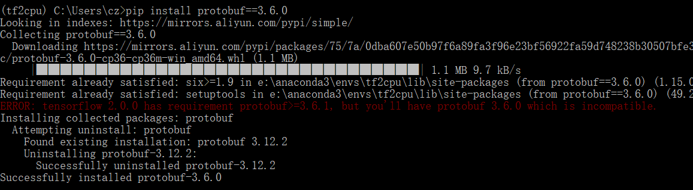

- 环境
  - python 3.6.0
  - cuda9.0
  - GPU GTX 1050Ti
- 安装tensorflow2.1.0
  - pip install tensorflow==2.1.0  fail
  - pip install tensorflow-cpu==2.1.0 fail
- 安装tensorflow2.0.0
  - pip install tensorflow==2.0.0  fail

- [stackoverflow](https://stackoverflow.com/questions/52092810/tensorflow-error-dll-load-failed-the-specified-procedure-could-not-be-found/53111377#53111377)提示protobuf版本要从3.6.1更换至3.6.0
  - 安装protobuf时，安装报警告tensorflow 2.0 require protobuf 3.6.1, 直接忽略
    
  - 更换protobuf完毕后，成功import tensorflow as tf

- 进一步查阅资料得知是python3.6.0的原因
  - 尝试以同样“错误”方法在python3.7版本上实验安装tf2.0
  - 在python版本3.6.5和3.7.0上均尝试安装tensorflow==2.0.0，导入成功

- 结论
  - python3.6.0版本存在对protobuf部分版本的不兼容，或者本身有缺陷，建议安装python3.6.x (x>=1)
  - 这种隐蔽的错误很难发现，尝试用同样方法测试安装pytorch

- 安装pytorch gpu版本，离线包安装，清华源镜像，pytorch-1.1.0-py3.6_cuda90_cudnn7_1.tar  torchvision-0.3.0-py36_cu90_1.tar
  - 在python3.6.0版本安装，conda install --use-local xxx ，安装完毕后，导入报错缺失DDL
  - 注意到离线包的cudnn7_1，猜测必须要对应cudnn7.1，本机是7.6.5，更换cudnn后，失败
  - 在python3.6.5版本安装，安装完毕后，导入报错缺失DDL
  - 升级python到3.6.7, conda install python==3.6.7 ,提示torch相关包inconsistent警告，忽略，更新了一些包，升级完毕后再导入torch，成功，显示torch.cuda.is_available()为TRUE

- 同理安装cpu版本的torch，也是在3.6.7版本安装成功，看来3.6.7是一个比较稳定的版本

