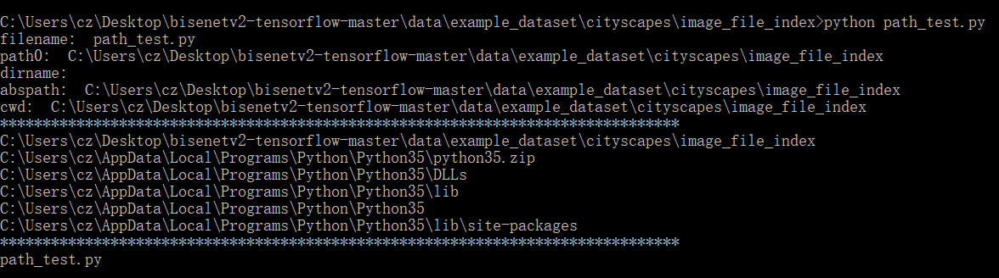

## 实验源码

```python

import sys, os

filename = sys.argv[0]
path0 = sys.path[0]
dirname = os.path.dirname(filename)
abspath = os.path.abspath(dirname)
cwd = os.getcwd()


print('filename: ', filename) # pycharm与命令行输出不一样，命令行只输出文件名称，而pycharm输出完整绝对路径

print('path0: ', path0)
print('dirname: ', dirname)
print('abspath: ', abspath)
print('cwd: ', cwd) #跟工作目录设置有关

print('*'*80)
for path in sys.path:
    print(path)


print('*'*80)
for arg in sys.argv:
    print(arg)
#如果把脚本文件名称起名为test_xxx.py 运行时自动调用pytest

# 想办法把project的根目录添加到sys.path中，便于用相对路径寻址
# 找到当前项目的项目的路径
print('*'*80)
base_dir = os.path.abspath(__file__)
print(base_dir)
for i in range(5):
    base_dir = os.path.dirname(base_dir)
print('base_dir: ', base_dir)

sys.path.append(base_dir)   # 将找到的项目的路径导入当前系统路径,插入到路径搜索队列最后一个
sys.path.insert(0, base_dir) # 会将base_dir作为第0个插入路径搜索队列，也就是最优先被搜索 相同路径可以被重复插入

for path in sys.path:
    print(path)

# 关于导入包的一个问题和例子
# https://stackoverflow.com/questions/31291608/effect-of-using-sys-path-insert0-path-and-sys-pathappend-when-loading-modul

```

- 运行结果
  
    

    